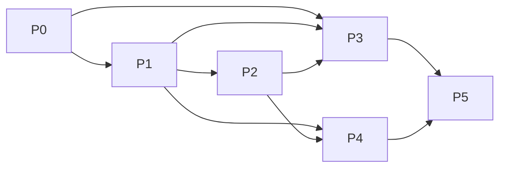

# Stage 2 Plan — near-recurrent-explorer

## TL;DR

This cycle ships a static, no-backend web page at `26 near-recurrent-explorer/`. Six
phases: freeze+export the eligible/ineligible-aware Stage-1 data (P0), port the RDP_v
near-recurrent classifier to JS (P1), port the BPR calibration fit to JS (P2), verify
both against the confirmed Python reference in parallel with building the UI (P3 ‖ P4),
then deploy (P5). Six decisions committed below.
**D5 revised 2026-08-20:** the conventional-unit comparison (peak-hour, hourly) is out
of scope entirely — the author confirmed those temporal units aren't of interest to this
project. See the decisions table.

## Decisions table

| ID | Decision | Choice | Why | If wrong |
|----|----------|--------|-----|----------|
| D1 | Charting/rendering | Hand-rolled SVG, no charting library | The visualizations are simple (a week×DOW grid, a scatter+line fit) and a library is a maintenance liability against P4 ("still works in three years") and the no-build-step goal | Add a light library (e.g. a single-file plotting script) if hand-rolled SVG proves too slow to build; low cost to switch, nothing else depends on the choice |
| D2 | Eligibility delivery | Pre-computed in the exporter, shipped as a static flag (closes G5) | Confirmed eligibility doesn't depend on the live parameters; live recomputation would be wasted complexity | Would require re-deriving `skip_flags` logic in JS — a full second port of Stage 2, not planned for |
| D3 | ζ (free-flow travel time) | Hardcoded per-station constant baked into the exporter from `MASTER_CONFIG['bpr_ff_speed_threshold']` (closes G9) | Values already exist, are static, and don't depend on live parameters | If the author later recomputes these values in Python, the exporter must be re-run — flagged in the exporter's own header comment |
| D4 | Build tooling | Plain ES modules, no bundler, no framework | Matches architecture's "no build step if avoidable"; keeps the artifact link-stable for years without a toolchain to rot | If module count grows unmanageably, revisit — not expected at this scope (2 algorithm ports + 1 UI) |
| D5 | ~~Conventional-unit comparison (peak-hour, hourly)~~ **OUT OF SCOPE (revised 2026-08-20)** | Originally: pre-computed once in Python, shown as static reference points on the BPR chart. **Superseded:** the author confirmed these temporal units are not of interest to this project — not deferred, not a TODO, permanently dropped. The `traffic_utils` Stage-4 failure for `temporal_scale='peak'`/`'hour_split'` found during P4 (phase-4 handoff) is therefore moot and not to be investigated. | Author's direct scope call, not a technical constraint | N/A — no longer a decision to get wrong |
| D6 | Directory for generated exports | `data/*.json`, one file per station + one `manifest.json` | Enables per-station lazy loading (mentioned in Frame architecture); keeps individual payloads small | A single combined JSON is simpler if lazy-loading turns out unnecessary at ~600 KB total — revisit only if load time (success criterion 5) fails |

## Phase DAG

| Phase | Deliverable | Depends on | Branch | α (autonomy) |
|-------|-------------|------------|--------|---------------|
| P0 | Exporter: `04_peak_period_result/` → `data/*.json` + eligibility + ζ baked in | — | data | 0.5 |
| P1 | RDP_v JS port (near-recurrent classification) | P0 | algorithm | 0.6 |
| P2 | BPR calibration JS port (aggregation + OLS fit) | P1 | algorithm | 0.6 |
| P3 | Parity harness — JS output vs. `references/bpr_calibration_reference_C3a.csv` | P0, P1, P2 | verify | 0.5 |
| P4 | Site UI — heatmap lead view, sliders, BPR panel, map | P1, P2 | ui | 0.6 |
| P5 | Deploy (GitHub Pages) + load-time check | P3, P4 | integration | 0.3 |

**Parallel branch coordination:** P3 and P4 both depend only on P1+P2 completing, not on
each other — they run concurrently. P3 (verification) uses α=0.5 deliberately lower than
P4 (α=0.6): a numerical mismatch against the confirmed reference is exactly the kind of
thing that should surface to a human rather than be silently reconciled. P5 cannot start
until both branches converge — deploying a UI that hasn't been verified against C3a would
violate C3 outright.

## Deliverable enumeration

### P0 — Exporter

Deliverables:
- `src/export_site_data.py` — reads `04_peak_period_result/c_daily_traffic_division_
  single_{VDS}_speedbasedpeak_5_RDP_v_speed-solely.csv` for the 9 paper stations; drops
  `off-peak` rows and the 7 unused columns identified in Frame (G2); computes and bakes
  in the eligibility flag (D2) and ζ (D3); writes one JSON per station to `data/` plus
  `data/manifest.json` (station list, labels, corridor, lat/lon from `station_meta.csv`)
- Does **not** modify anything under `traffic_utils/` or `04_peak_period_result/`

Verification recipe: `python3 src/export_site_data.py` exits 0; `data/manifest.json`
lists exactly 9 stations; total `data/` size < 1 MB (tripwire, budget from G2's ~600 KB
estimate); spot-check one station's JSON against its source CSV by hand.

### P1 — RDP_v JS port

Deliverables:
- `src/rdpv.js` — the modified RDP algorithm (vertical-distance tolerance, recursive
  split; see `traffic_utils/recurrent.py::rdp_v` and `classify_facet_rdpv`), the
  cumulative start/end-time series construction, the gap-breakpoint union logic
  (Section 3.3 of the paper — weeks with no detected peak are hard boundaries), and the
  `min_len` filter
- Explicitly ports: `classify_facet_rdpv`'s core logic. Explicitly does **not** port:
  `_dedup_multiple_peaks` unless P1's author determines during porting that the paper's
  9 stations actually exercise the multiple-peaks-per-day path (uncertainty flagged in
  Frame architecture) — if so, this becomes a documented mid-phase scope addition, not a
  silent omission

Verification recipe: for one station-period pair (SR91-EB AM, chosen because it's
eligible and mid-sized at N=19), print the JS port's retained-interval boundaries
side-by-side with a manual trace through `recurrent.py` at the same inputs. Must match.

### P2 — BPR calibration JS port

Deliverables:
- `src/bpr.js` — interval aggregation (arithmetic mean for N, N-weighted harmonic mean
  for speed — Equations 8–9 of the paper), and OLS on the log-linear form
  `ln(z/ζ − 1) = ln α̃ + β ln N` (Equation 11)

Verification recipe: feed P2 the (N_r, z_r) pairs P1 produces for SR91-EB AM; confirm
`(log α̃, β, R²)` matches the reference row (−8.431254, 0.960746, —) to ≥3 decimals.

### P3 — Parity harness

Deliverables:
- `src/parity.js` (or a small HTML page) — runs P1+P2 at C3a parameters (AM ε=0.15,
  PM ε=0.19, min_len=3) across all 9 stations × 2 periods; loads
  `references/bpr_calibration_reference_C3a.csv`; reports per-cell deviation and a
  pass/fail per station-period
- `references/parity-report-{date}.md` — the harness's output, committed as evidence

Verification recipe (this is where G1 and success criterion 4 actually close): every
eligible cell agrees with the reference to ≥3 decimals; the excluded set (7
station-periods) matches exactly. A failing cell is a defect in P1 or P2, not in the
reference — the reference is fixed per C3.

### P4 — Site UI

Deliverables:
- `index.html`, `src/ui.js`, `src/style.css`
- Lead view: week × day-of-week heatmap (🟩 recurrent / 🟧 congested-not-recurrent /
  ⬜ no congestion), per Frame's chosen framing (option A from the earlier discussion)
- Three sliders: `epsilon_start`, `epsilon_end`, `min_len`, defaulting to C3a (per Frame:
  opens at reference, adjustable from there)
- BPR panel: near-recurrent fit (live) shown against the pre-computed conventional-unit
  points (D5, static)
- Map (Leaflet, per architecture) for station selection
- Excluded station-periods shown with their reason (rate vs. 75/yr requirement), not
  silently hidden — per C4a

Verification recipe: manual click-through — moving any of the three sliders updates the
heatmap and BPR fit with no page reload and no network request after initial load;
confirmed against P3's harness by spot-checking 2 non-reference parameter settings by
hand.

### P5 — Deploy

Deliverables:
- GitHub Pages deployment (or equivalent static host)
- `README.md` updated with the live URL

Verification recipe: cold-load timing test on a normal connection, target <3s (success
criterion 5); the deployed page's output at C3a parameters matches P3's harness output
(deployment didn't silently break anything).

## Tripwires and budgets

- **Export size ≤ 1 MB total** for `data/`. If exceeded, revisit D6 (per-station lazy
  loading) before adding compression.
- **JS port LoC budget ≤ 500** combined (`rdpv.js` + `bpr.js`). If exceeded, reconsider
  whether the full `_dedup_multiple_peaks` path (flagged uncertain in Frame) is actually
  needed for these 9 stations, since it's the most likely source of unplanned growth.
- **Parity tolerance: ≥3 decimal agreement, exact match on the excluded set.** Non-
  negotiable per C3 — this is not a budget to relax if P3 fails, it's a signal P1 or P2
  has a defect.
- **Load time < 3s** on a normal connection (success criterion 5, restated as a P5
  tripwire).

## Uncertainty markers

- **Confident:** P0–P2 are well-specified; the algorithms are fully read and the
  reference target is a real, confirmed number, not an assumption.
- **Uncertain:** whether `_dedup_multiple_peaks` is exercised by any of the 9 stations at
  C3a parameters. P1's verification recipe (checked against SR91-EB AM only) will not
  surface this if it's a rare path — the full P3 harness across all 18 station-periods is
  the real backstop.
- **Uncertain:** D1 (hand-rolled SVG) is a bet that the week×DOW heatmap and the BPR
  scatter+line are simple enough to not need a library. If P4 proves this wrong, it's a
  cheap pivot (swap the rendering layer only) since D4 already commits to no build step
  either way.
- **Not yet decided:** exact visual treatment of excluded station-periods in the heatmap
  (grayed row? a distinct icon + tooltip with the rate?) — left to P4's judgment within
  the C4a constraint, not worth a Plan-level decision.

## See also

- `stage-1-frame-problem-Sonnet5CC.md`, `stage-1-frame-architecture-Sonnet5CC.md`,
  `stage-1-frame-gaps-Sonnet5CC.md`
- `references/bpr_calibration_reference_C3a.csv` — the P3 parity target
